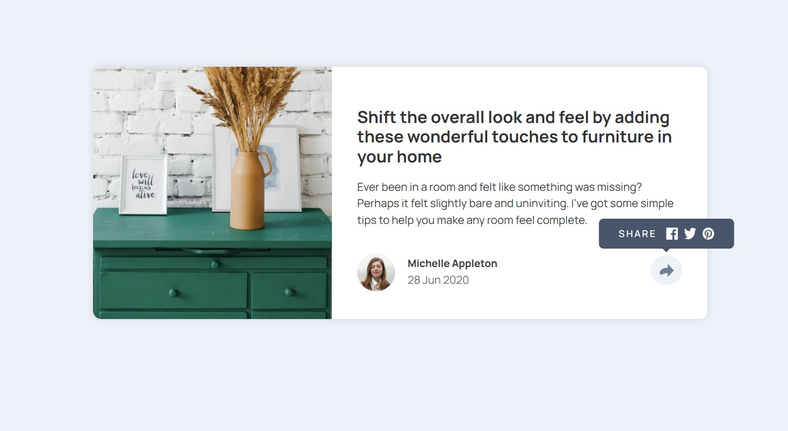

# Frontend Mentor - Article preview component solution

This is a solution to the [Article preview component challenge on Frontend Mentor](https://www.frontendmentor.io/challenges/article-preview-component-dYBN_pYFT). Frontend Mentor challenges help you improve your coding skills by building realistic projects. 

### The challenge

Users should be able to:

- View the optimal layout for the component depending on their device's screen size
- See the social media share links when they click the share icon
- Build out the project to the designs provided

### Screenshot



### Built with

- Semantic HTML5 markup
- CSS custom variables
- Flexbox
- Mobile-first workflow - Media Queries
- [React](https://reactjs.org/) - JS library


### Live Project

[View Live Project](https://trishachi.github.io/article-preview-react/)

### Source Code

[View Source Code](https://github.com/Trishachi/article-preview-react)

### Deployment Steps for Vite Project

1. Set up React Application
2. Install and configure gh-pages on your terminal using the command: 
```npm install gh-pages --save-dev```
3. Create a GitHub repository for your project  
4. Open the vite.config.js file in your project and add a field base to the export default using the command:
```base: '/[repository-name]/'```
5. Update package.json files with the following:
```bash {
    "homepage": "[repository url]",
    ...
    "scripts": {
        "predeploy": "npm run build",
        "deploy": "gh-pages -d dist",
        ... 
    },
}
```
6. Create the dist folder by running the following command in your terminal:
```bash
npm run build
```

7. Push your React app to your GitHub Repository
8. Deploy your application with the command:
```bash
npm run deploy
```
9. On the project repository on GitHub, navigate to Settings -> Pages
10. Select gh-pages under the Build and Deploy section
11. Refresh page and follow site link to view site.

## Author

- [My Portfolio](https://trishachi.github.io/)
- [Frontend Mentor Profile](https://www.frontendmentor.io/profile/Trishachi)
- [LinkedIn Profile](https://www.linkedin.com/in/chisom-trisha-okoye/)

